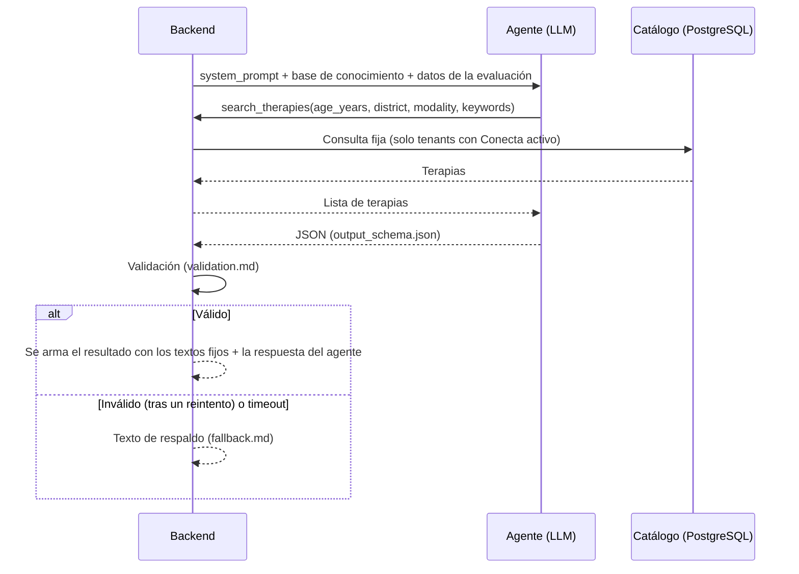

# Agente IA de Conecta (capa 3)

El agente **explica** el resultado del tamizaje en lenguaje simple y elige, del catálogo de los centros afiliados, las terapias que encajan con el niño o niña. **No decide nada clínico:** el nivel, el perfil y las reglas vienen del modelo de ML y de las reglas clínicas (`docs/reglas_clinicas.md`).

Versión del prompt: `prompt-2026.4` · 2026-10-08 · Estado: **evaluado** (48/48 con gpt-4.1-mini; ver `eval/RESULTS.md`); pendiente de revisión de especialistas

| Archivo | Contenido |
|---|---|
| `system_prompt.md` | Instrucciones del agente (rol, pasos, reglas, formato) |
| `input_example.json` | Datos de una evaluación tal como los recibe el agente |
| `output_schema.json` | Formato JSON obligatorio de la respuesta |
| `tools.json` | Definición de la herramienta `search_therapies` |
| `validation.md` | Qué revisa el backend antes de mostrar la respuesta |
| `fallback.md` | Texto de respaldo cuando el agente falla |
| `eval/` | Set de evaluación (48 casos), catálogo de prueba, verificador automático y rúbrica para especialistas |

## Flujo

## Quién escribe qué en la pantalla de resultado

| Parte | La escribe | Fuente |
|---|---|---|
| Título del nivel | Backend [texto fijo] | `knowledge/levels.md` |
| Resumen personalizado | **Agente** | `summary` |
| Perfil (nombre y barras) | Backend [texto fijo] | `knowledge/profiles.md` |
| Explicación del perfil | **Agente** | `profile_explanation` |
| Recomendaciones de las reglas | Backend [texto fijo] | `knowledge/recommendations.md` |
| Próximos pasos | **Agente** | `next_steps` |
| Terapias sugeridas y por qué | **Agente** (elige y explica) + backend (ordena los centros) | `suggested_therapies` |
| Avisos (edad, no diagnóstico, IA, emergencia) | Backend [texto fijo] | `knowledge/age_messages.md`, `knowledge/notices.md` |

Así, todo lo que tiene peso clínico o legal es texto fijo aprobado, y el agente solo personaliza la explicación.
