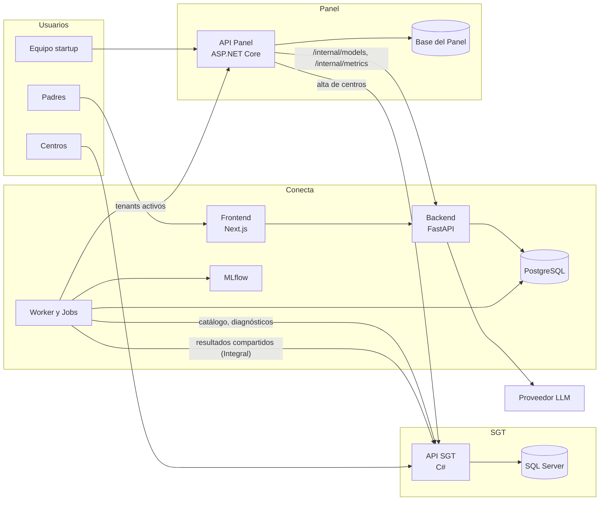
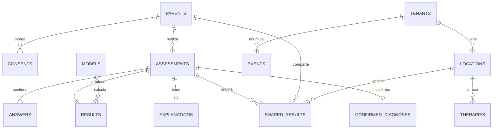
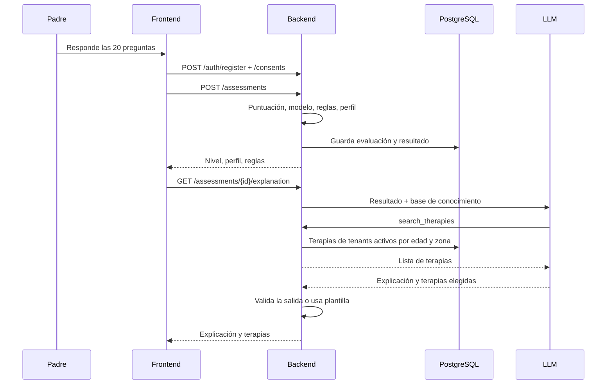
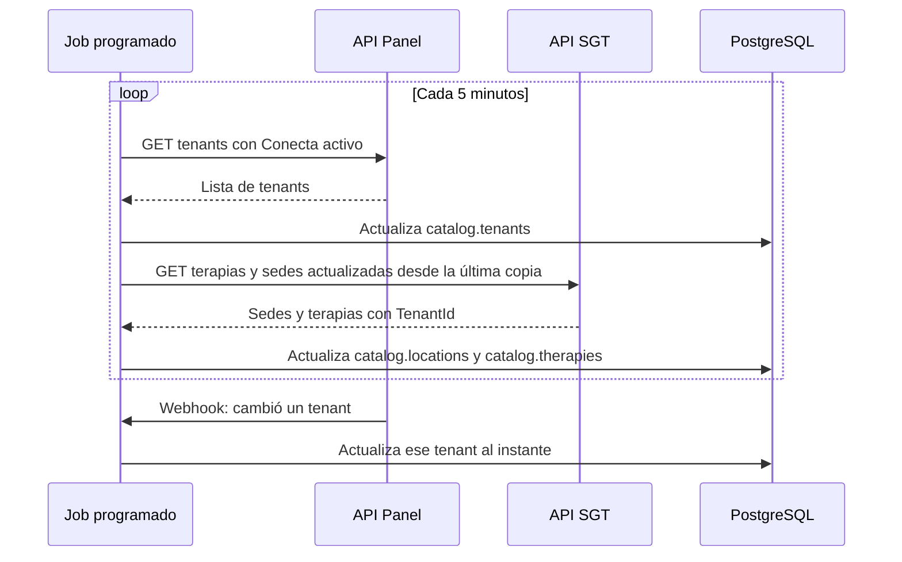
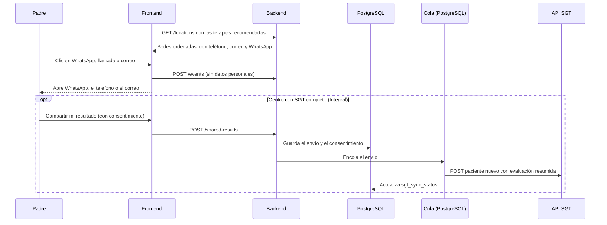
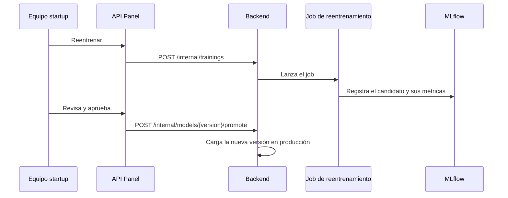

# Arquitectura de Conecta

Arquitectura técnica de la **Solución 1: Conecta** (plataforma de tamizaje), con su frontend, su backend y su base de datos, y cómo se integra con el SGT y el Panel Startup.

Versión 1.3 · 2026-10-02

---

## 0. Vista general

### 0.1 Los tres espacios

| Espacio | Tecnología | Base de datos | Dueño de… |
|---|---|---|---|
| **Conecta** | Next.js (frontend) + FastAPI (backend) | PostgreSQL | Tamizajes, resultados, modelo de ML, agente IA, resultados compartidos con centros, métricas de uso |
| **SGT** | C# | SQL Server 2022+ | Centros, sedes (con teléfono, correo y WhatsApp), terapias, pacientes, citas. Incluye la versión limitada del SGT (panel de autogestión) para los centros que solo contratan Conecta |
| **Panel Startup** | ASP.NET Core + React/TypeScript | Propia | **TenantId**, estado de cada centro, productos habilitados (Conecta, SGT), suscripciones, vista de modelos y métricas |

**Regla principal:** cada espacio es dueño de su base de datos. Los demás obtienen esos datos **a través de su API**, nunca entrando directo a la base.

**Convención:** rutas, endpoints, módulos, esquemas, tablas, columnas y valores de estado se nombran **en inglés**; los textos que ve el usuario van en español.

### 0.2 TenantId y productos habilitados

- El **TenantId** identifica a cada centro cliente en los tres espacios.
- Lo crea el **Panel Startup** al registrar un centro, junto con los productos que contrató. Un centro no puede habilitarse productos a sí mismo.
- El Panel crea el centro en el **SGT** con el mismo TenantId: en versión limitada si solo tiene Conecta, completa si tiene SGT.
- **Conecta consulta al Panel** qué tenants tienen Conecta activo (opción A acordada). Si un centro deja de tener Conecta, desaparece de las recomendaciones aunque sus terapias sigan en el SGT.

**Alta de un centro:**

1. El equipo registra el centro en el Panel → se genera su TenantId y se marcan sus productos.
2. El Panel crea el centro en el SGT con ese TenantId.
3. El centro carga sus sedes (con sus datos de contacto) y terapias en el SGT (completo o limitado).
4. Conecta copia el catálogo del SGT: cada sede y terapia trae su TenantId.
5. Conecta copia del Panel la lista de tenants con Conecta activo y solo muestra esos centros a los padres.

### 0.3 Diagrama general



---

## 1. Alcance de Conecta

| Incluido | Fuera de Conecta |
|---|---|
| Landing y páginas públicas de los centros | Panel de autogestión de los centros (es la versión limitada del SGT, en C#) |
| Prueba de tamizaje, registro del padre y resultado | Alta de centros, TenantId, productos y suscripciones (Panel Startup) |
| Modelo de ML, reglas clínicas, perfiles y agente IA | Gestión de citas y pacientes (SGT) |
| Terapias sugeridas, comparación de sedes y datos de contacto de los centros | Programa de referidos y puntos (fase posterior, solo para centros con SGT) |
| Métricas de uso para el reporte mensual de los centros | Facturación (Panel Startup) |
| Endpoints internos de modelos y métricas para el Panel | |

---

## 2. Frontend (Next.js)

### 2.1 Tecnologías

| Tema | Elección | Motivo |
|---|---|---|
| Framework | **Next.js** (App Router) + **TypeScript** | Páginas públicas generadas en el servidor (aparecen en Google) y app interactiva en el mismo proyecto |
| Estilos | Tailwind CSS + librería de componentes accesible (p. ej. shadcn/ui) | Rápido de construir, consistente y accesible |
| Datos del servidor | TanStack Query | Caché, reintentos y estados de carga |
| Formularios | React Hook Form + Zod | Validación en el cliente con los mismos esquemas que espera el backend |
| Sesión | Cookie `httpOnly` emitida por el backend | El token no queda expuesto al JavaScript del navegador |
| Pruebas | Vitest (componentes) + Playwright (recorridos completos) | |

### 2.2 Rutas

| Ruta | Pantalla | Tipo |
|---|---|---|
| `/` | Landing de Conecta | Pública, generada en servidor |
| `/centers` | Directorio de centros | Pública, generada en servidor |
| `/centers/[slug]` | Página del centro: información, sedes, terapias y contacto | Pública, regenerada al cambiar el catálogo |
| `/screening` | Inicio de la prueba: qué es, cuánto dura, consentimiento | Pública |
| `/screening/questions` | Las 20 preguntas, una por pantalla, con progreso | Pública; se puede retomar |
| `/signup` | Crear cuenta antes de ver el resultado | Pública |
| `/results/[id]` | Nivel de riesgo, perfil y explicación | Requiere sesión |
| `/results/[id]/therapies` | Terapias sugeridas y sedes que las ofrecen | Requiere sesión |
| `/results/[id]/locations` | Comparación de sedes con botones de WhatsApp, llamada y correo | Requiere sesión |
| `/account` | Historial de pruebas y datos del padre | Requiere sesión |
| `/privacy`, `/terms` | Textos legales | Pública |

### 2.3 Criterios

- **Mobile first:** una pregunta por pantalla, botones grandes y barra de progreso.
- El frontend **solo habla con el backend de Conecta**; nunca con el SGT, el Panel ni el proveedor del LLM.
- El avance de la prueba se guarda para poder retomarla. Las respuestas se envían al backend al terminar.
- El resultado se muestra en dos tiempos: primero el nivel y el perfil (instantáneo) y luego la explicación del agente IA (carga diferida).
- Accesibilidad AA, español de Perú y avisos obligatorios ("esto no es un diagnóstico") en el resultado.
- **Contacto directo:** cada sede muestra botones de **WhatsApp** (`wa.me/51…` con un mensaje precargado genérico, p. ej. *"Hola, vengo de Neuroa y quiero información sobre su terapia de lenguaje"*), **llamada** (`tel:`) y **correo** (`mailto:`). El mensaje de WhatsApp **nunca incluye el resultado del tamizaje**.
- Solo en sedes de centros con SGT completo (plan Integral) aparece además **"Compartir mi resultado con este centro"**, con consentimiento explícito.
- Las visitas a las páginas de los centros y los clics en los botones de contacto se registran como eventos para el reporte mensual, sin datos personales.

---

## 3. Backend (FastAPI)

### 3.1 Tecnologías

| Tema | Elección |
|---|---|
| Lenguaje y framework | Python 3.12, FastAPI, Pydantic v2 |
| Base de datos | PostgreSQL con SQLAlchemy 2 y migraciones con Alembic |
| Procesos en segundo plano | **Cola en PostgreSQL** (p. ej. Procrastinate) para tareas a pedido + **Azure Container Apps Jobs** para tareas programadas y pesadas. Sin Redis |
| Modelo | scikit-learn 1.6.1 (`models/v2/modelo_tamizaje_tea.pkl` + `metadata.json`) |
| Seguimiento de modelos | MLflow (almacenamiento en PostgreSQL) |
| Llamadas a otras APIs | httpx, con reintentos y tiempos límite |
| Agente IA | Modelo desplegado en **Azure OpenAI / Microsoft Foundry**, con *tool calling* (LangGraph cuando el flujo crezca) |

### 3.2 Estructura de módulos

```
conecta-api/
├── app/
│   ├── auth/          ← registro, login y sesión de padres
│   ├── screening/     ← evaluaciones, respuestas, puntuación Q-CHAT-10
│   ├── risk/          ← capa 1 (modelo), capa 2 (reglas) y perfiles
│   ├── agent/         ← capa 3: prompt, base de conocimiento, search_therapies
│   ├── catalog/       ← copia de centros, sedes y terapias del SGT + tenants activos del Panel
│   ├── sharing/       ← resultados compartidos con centros Integral y envío al SGT
│   ├── metrics/       ← eventos y reportes mensuales por centro
│   ├── model_registry/ ← versiones, métricas, reentrenamiento (MLflow)
│   ├── internal/      ← endpoints para el Panel Startup
│   ├── integrations/  ← clientes HTTP del SGT, del Panel, del LLM y de correo
│   └── core/          ← configuración, seguridad, base de datos, logs
├── tasks/             ← tareas de la cola en PostgreSQL (envíos al SGT, correos)
├── jobs/              ← jobs programados (catálogo, diagnósticos) y reentrenamiento
├── knowledge/         ← base de conocimiento curada del agente (versionada)
└── models/            ← modelo y metadata.json
```

### 3.3 Endpoints públicos (para el frontend)

| Método y ruta | Uso |
|---|---|
| `POST /auth/register`, `POST /auth/login`, `POST /auth/logout` | Cuenta del padre |
| `POST /consents` | Registrar el consentimiento del padre o tutor |
| `POST /assessments` | Enviar las respuestas de la prueba; devuelve el id de la evaluación |
| `GET /assessments/{id}/result` | Nivel, probabilidad, perfil y reglas activadas |
| `GET /assessments/{id}/explanation` | Explicación y terapias sugeridas por el agente IA |
| `GET /assessments` | Historial del padre |
| `GET /centers`, `GET /centers/{slug}` | Directorio y página pública de un centro (solo tenants activos) |
| `GET /locations?therapies=…&district=…` | Sedes que ofrecen las terapias recomendadas, con sus datos de contacto, en el orden definido en 3.6 |
| `POST /shared-results` | El padre comparte su resultado con una sede de un centro Integral (requiere consentimiento) |
| `POST /events` | Visitas y clics en WhatsApp, llamada y correo, para las métricas de los centros |

### 3.4 Endpoints internos (para el Panel Startup)

Bajo `/internal`, con autenticación entre servicios. Devuelven **agregados**, nunca datos individuales de niños.

| Método y ruta | Uso |
|---|---|
| `GET /internal/models` | Versión en producción y candidatos |
| `GET /internal/models/{version}/metrics` | AUC, sensibilidad y especificidad: de validación y reales |
| `GET /internal/metrics/usage` | Tamizajes por día y distribución de niveles de riesgo |
| `GET /internal/metrics/centers/{tenant_id}` | Visitas, clics de contacto y conversión por centro (reporte mensual) |
| `GET /internal/metrics/bias` | Rendimiento por sexo y edad |
| `POST /internal/trainings`, `GET /internal/trainings/{id}` | Lanzar y seguir un reentrenamiento |
| `POST /internal/models/{version}/promote` | Pasar un candidato a producción (queda registrado quién lo aprobó) |
| `POST /internal/webhooks/tenants` | El Panel avisa que cambió el estado de un tenant |

### 3.5 Integraciones

| Con | Qué | Cómo |
|---|---|---|
| **API SGT** | Copia de centros, sedes (con teléfono, correo y WhatsApp) y terapias, con TenantId | Job programado cada 5 minutos con `updated_since` |
| **API SGT** | Paciente nuevo cuando un padre comparte su resultado con un centro Integral | Cola en PostgreSQL con reintentos |
| **API SGT** | Diagnósticos confirmados (con consentimiento) para reentrenar | Job diario |
| **API Panel** | Tenants con Conecta activo | Job programado cada 5 minutos + webhook del Panel ante cambios |
| **Azure OpenAI / Foundry** | Explicación del resultado y elección de terapias | Llamada con *tool calling*; textos plantilla si falla |
| **Correo** | Confirmaciones y resultado en PDF para el padre | Cola en PostgreSQL |

### 3.6 Cálculo del resultado

`POST /assessments` ejecuta en orden:

1. **Validación** de las 20 respuestas (Pydantic) y del consentimiento.
2. **Puntuación** de A1–A10 igual que el Q-CHAT-10 oficial.
3. **Capa 1 (modelo):** probabilidad calibrada y comparación con el umbral de `metadata.json`.
4. **Capa 2 (reglas clínicas):** comorbilidades, antecedente familiar y edad pueden subir el nivel (Bajo / Moderado / Alto / Prioritario).
5. **Perfil:** porcentajes comunicativo y social con los pesos validados por especialistas.
6. Se guarda todo con las **versiones** del modelo y de las reglas, y se devuelve el resultado.
7. **Capa 3 (agente IA):** se genera la explicación aparte. El agente llama a `search_therapies`, que consulta la copia del catálogo filtrando por tenants activos, edad y zona. El backend valida la salida; si falla, se usan textos plantilla.

**Quién decide qué:**

| Decisión | Quién | Cómo |
|---|---|---|
| **Qué terapias le sirven al niño** | El LLM | Lee el contexto del niño y el nombre y la descripción de cada terapia, y marca **todas** las que encajan (no elige una "favorita"), explicando por qué en términos de necesidad |
| **En qué orden se muestran los centros** | El backend | 1. Agrupa las terapias marcadas por centro y sede. 2. Ordena por cercanía (mismo distrito del padre, luego cercanos). 3. Rota entre sedes empatadas con un orden aleatorio que cambia cada día |

Así el LLM personaliza la recomendación sin favorecer a unos centros sobre otros, que pagan por aparecer. Si algún día se cobra por aparecer primero, debe mostrarse como **"Destacado"**.

### 3.7 Seguridad

- Sesión de padres con cookie `httpOnly` y `SameSite`; contraseñas con hash robusto (argon2).
- Autenticación entre servicios (API key o credenciales de cliente) para `/internal` y para las llamadas al SGT y al Panel.
- Límite de peticiones en el login, el registro y el envío de evaluaciones.
- Logs sin datos personales; las respuestas de salud nunca van a los logs.
- Cifrado en tránsito (HTTPS) y en reposo (base de datos y respaldos).
- Al proveedor del LLM solo se envían los datos necesarios, sin nombre ni contacto del padre.

---

## 4. Base de datos (PostgreSQL)

### 4.1 Esquemas

| Esquema | Contenido |
|---|---|
| `app` | Datos propios de Conecta: padres, evaluaciones, resultados, resultados compartidos, eventos |
| `catalog` | Copias de solo lectura: tenants activos (del Panel) y centros, sedes y terapias (del SGT) |
| `ml` | Versiones del modelo, métricas, entrenamientos y diagnósticos confirmados |
| `queue` | Tareas pendientes de la cola (estado, reintentos, errores) |
| `mlflow` | Almacenamiento interno de MLflow |

### 4.2 Tablas principales

| Tabla | Campos clave |
|---|---|
| `app.parents` | id, email, full_name, phone, district, created_at |
| `app.consents` | id, parent_id, text_version, purposes, accepted_at, revoked_at |
| `app.assessments` | id, parent_id, age_months, sex, status, started_at, completed_at |
| `app.answers` | assessment_id, question_id, option_index (0–4 o sí/no/no sé), binary_value |
| `app.results` | assessment_id, qchat10_score, probability, threshold, is_positive, base_level, final_level, triggered_rules, communication_pct, social_pct, profile, model_version, rules_version |
| `app.explanations` | assessment_id, source (llm, template), text, suggested_therapies, prompt_version, knowledge_version |
| `app.shared_results` | id, parent_id, assessment_id, tenant_id, location_id, consent_id, sgt_sync_status, created_at |
| `app.events` | id, type (page_view, whatsapp_click, call_click, email_click), tenant_id, location_id, occurred_at (sin datos personales) |
| `catalog.tenants` | tenant_id, name, conecta_enabled, has_full_sgt, updated_at |
| `catalog.locations` | location_id, tenant_id, name, slug, district, address, phone, email, whatsapp, updated_at |
| `catalog.therapies` | therapy_id, tenant_id, location_id, name, description, min_age_months, max_age_months, modality, is_active, updated_at |
| `ml.confirmed_diagnoses` | assessment_id, diagnosis, diagnosis_date, source (SGT), consent_id |
| `ml.models` | version, status (candidate, production, retired), metrics, mlflow_run_id, approved_by, promoted_at |
| `ml.trainings` | id, status, resulting_version, started_by, started_at, finished_at |

### 4.3 Diagrama entidad-relación



### 4.4 Datos sensibles y retención

- Los datos de salud del niño (respuestas y resultados) son **datos sensibles** según la Ley N.º 29733: requieren consentimiento expreso del padre o tutor (a validar con asesoría legal).
- **No se guarda el nombre del niño**; solo edad en meses y sexo.
- Para reentrenar y para las métricas se usan **datos anonimizados** (sin padre ni contacto).
- Plazos de conservación acordados (a validar con asesoría legal):

| Dato | Plazo |
|---|---|
| Cuenta del padre | Mientras la cuenta esté activa; se borra a pedido (derechos ARCO) |
| Evaluaciones y resultados | Mientras la cuenta esté activa, o 2 años sin actividad, y luego se anonimizan |
| Datos anonimizados (reentrenamiento y métricas) | Sin plazo, porque ya no identifican a nadie |
| Eventos de clics y visitas | 24 meses |
| Logs técnicos | 90 días |
| Datos enviados al LLM | Sin retención del proveedor (exigido en el contrato) |

---

## 5. Flujos principales

### 5.1 Tamizaje de principio a fin



### 5.2 Copia del catálogo y de los tenants activos



### 5.3 El padre contacta un centro



### 5.4 Reentrenamiento del modelo



---

## 6. Despliegue (Azure, región Brazil South · São Paulo)

| Componente | Servicio de Azure |
|---|---|
| `conecta-web` (Next.js) | Azure Container Apps |
| `conecta-api` (FastAPI) | Azure Container Apps |
| `conecta-worker` (procesa la cola en PostgreSQL) | Azure Container Apps |
| Jobs: copia del catálogo, diagnósticos, reentrenamiento | Azure Container Apps Jobs (solo cobran mientras corren) |
| PostgreSQL | Azure Database for PostgreSQL (Flexible Server) |
| MLflow | Azure Container Apps + Azure Blob Storage para los modelos |
| LLM | Azure OpenAI / Microsoft Foundry |
| Secretos y claves | Azure Key Vault |

- **Ambientes:** desarrollo, pruebas (*staging*) y producción, cada uno con su base de datos.
- **CI/CD:** en cada cambio se ejecutan pruebas, lint y migraciones en pruebas; el despliegue a producción requiere aprobación.
- **Monitoreo:** Azure Monitor y Application Insights para logs y métricas de la API, alertas si fallan las copias del SGT o del Panel y alertas de costo del LLM.

---

## 7. Decisiones

### 7.1 Tomadas

| Tema | Decisión |
|---|---|
| Nube y región | **Azure, Brazil South (São Paulo)**. La transferencia de datos fuera del Perú se informa en el consentimiento (a validar con asesoría legal) |
| Tareas en segundo plano | **Cola en PostgreSQL** + **Azure Container Apps Jobs**, sin Redis. Celery + Redis solo si en el futuro el volumen crece mucho; el código de las tareas queda separado para migrar sin rehacerlo |
| Contactos de los centros | El padre contacta **directo** con los datos que cada centro gestiona en su SGT (WhatsApp, llamada, correo). Para centros Integral, opción de compartir el resultado con consentimiento |
| Recomendación de terapias | El LLM decide **qué terapias** encajan (todas las que encajen); el backend decide **el orden** de los centros (cercanía y rotación diaria) |
| Plazos de conservación | Tabla de la sección 4.4 (a validar con asesoría legal) |

### 7.2 Pendiente: modelo de LLM

Se elige con el set de 40–60 casos de prueba del agente. Candidatos, todos disponibles en Azure:

| Modelo | Entrada / salida (US$ por millón de tokens) | Costo aprox. por tamizaje | Rol en la evaluación |
|---|---|---|---|
| gpt-4.1-mini | 0.40 / 1.60 | $0.009 | Candidato |
| gpt-5-mini | 0.25 / 2.00 | $0.007 | Candidato |
| gpt-4o-mini | 0.15 / 0.60 | $0.003 | Candidato (verificar fecha de retiro en Azure) |
| gpt-5-nano / gpt-4.1-nano | 0.05–0.10 / 0.40 | $0.001–0.002 | Candidato económico |
| Claude Haiku 4.5 / Sonnet 5.5 | 1 / 5 · 2 / 10 | $0.023 · $0.046 | Referencia de calidad |

- Supuesto: ~18 mil tokens de entrada y ~1 mil de salida por tamizaje, sin caché. Con caché del prompt el costo baja.
- Criterio: el modelo más barato que cumpla las reglas del agente (no diagnosticar, tono, JSON válido, terapias correctas) con calidad cercana a la referencia.
- Precios de fuentes públicas de 2026: confirmarlos en la calculadora de Azure y verificar la disponibilidad en Brazil South.

Más detalle sobre el modelo, las reglas clínicas, el agente y los aspectos legales: `docs/consideraciones_app_tamizaje.md`.
