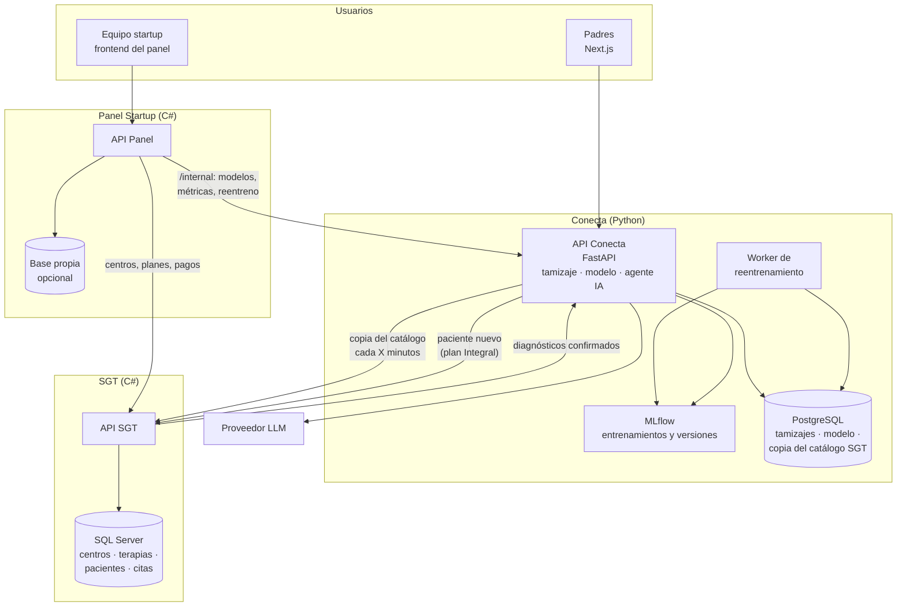
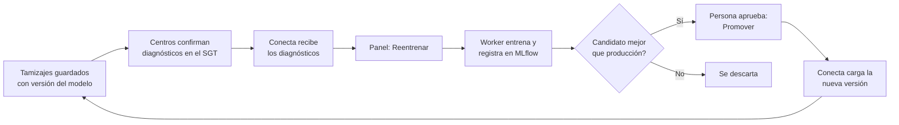

# Arquitectura técnica — Solución Conecta (plataforma de tamizaje)

Documento de alto nivel con la arquitectura elegida para la Solución 1 (Conecta) y su integración con el SGT y el panel interno de la startup.

---

## 1. Contexto

| Sistema | Tecnología | Base de datos | Dueño de… |
|---|---|---|---|
| **API Conecta** | FastAPI (Python) | PostgreSQL | Tamizajes, resultados, modelo de ML, agente IA |
| **API SGT** | C# | SQL Server 2022+ | Centros, sedes, terapias, planes, pacientes, citas. Incluye a los centros del plan Conecta, que usan una versión limitada del SGT (panel de autogestión) |
| **API Panel Startup** | C# | Propia (si la necesita) | Vista interna del negocio: centros que pagan, suscripciones, métricas, modelos |

**Regla principal:** cada API es dueña de su base de datos. Los demás sistemas obtienen esos datos **a través de su API**, nunca entrando directo a la base.

---

## 2. Decisiones

| Tema | Decisión | Motivo |
|---|---|---|
| Backend de Conecta | **FastAPI** | Validación de datos incluida, documentación automática, buen manejo de llamadas simultáneas (LLM, otras APIs) y el mismo lenguaje que el modelo de ML |
| Frontend de Conecta | **Next.js (React)** | Rápido en celular y con buen posicionamiento en Google para las páginas de los centros |
| Integración con el SGT | **Por API, con copia del catálogo** (propuesta B) | Conecta sigue funcionando aunque el SGT no esté disponible, y el agente responde más rápido |
| Panel interno ↔ Conecta | **Endpoints internos de FastAPI** (no acceso directo a PostgreSQL) | Reentrenar y promover modelos son acciones que deben ejecutarse donde vive el modelo; además, el panel no ve datos individuales de niños |
| Seguimiento de modelos | **MLflow** | Registra entrenamientos, métricas y versiones (candidato / producción) |

### Propuestas evaluadas

| | A. Integración directa | **B. Copia vía API (elegida)** | C. Eventos y microservicios |
|---|---|---|---|
| Cómo obtiene Conecta las terapias | Llama al API del SGT en cada consulta | Copia periódica desde el API del SGT a PostgreSQL | Eventos publicados por el SGT en una cola de mensajes |
| Funciona si el SGT se cae | ❌ | ✅ | ✅ |
| Complejidad | Baja | Media | Alta |
| Etapa | Piloto | Lanzamiento real | Escala |

Las propuestas son un camino de evolución: A → B → C.

---

## 3. Arquitectura final

---

## 4. Qué hace cada componente

### API Conecta (FastAPI)
- Recibe el tamizaje del padre, calcula el riesgo con el modelo (capa 1), aplica las reglas clínicas (capa 2), calcula el perfil y llama al agente IA (capa 3).
- El agente consulta las terapias con la herramienta `buscar_terapias`, que lee la **copia del catálogo** en PostgreSQL.
- Expone endpoints públicos (para los padres) e internos (para el panel).

### PostgreSQL (Conecta)
- Evaluaciones, respuestas, resultados, versión del modelo usada y reglas activadas.
- Diagnósticos confirmados que llegan del SGT (etiquetas para reentrenar).
- Copia de centros y terapias del SGT.
- Almacenamiento de MLflow.

### Worker de reentrenamiento + MLflow
- Reentrena el modelo en un proceso aparte, sin afectar a los usuarios.
- Registra cada entrenamiento en MLflow. El nuevo modelo queda como **candidato** hasta que una persona lo aprueba.

### API SGT (C#)
- Fuente oficial de centros y terapias de todos los planes.
- Recibe los pacientes nuevos que llegan desde el tamizaje (plan Integral).
- Entrega los diagnósticos confirmados, con consentimiento del padre.

### API Panel Startup (C#)
- Muestra los centros, planes y pagos (desde el SGT) y el uso y rendimiento de los modelos (desde Conecta).
- Lanza reentrenamientos y promueve modelos llamando a los endpoints internos de Conecta.

---

## 5. Contratos entre APIs

### 5.1 Lo que el SGT expone a Conecta

| Endpoint | Uso |
|---|---|
| `GET /terapias?actualizado_desde=…` | Centros y terapias activos: nombre, descripción, rango de edad, modalidad, distrito, plan del centro. Lo usa la copia periódica |
| `POST /pacientes` | Crea el paciente que llega desde el tamizaje (solo centros con plan Integral) |
| `GET /diagnosticos-confirmados?desde=…` | Diagnósticos confirmados con consentimiento, para reentrenar |
| *(opcional)* webhook de cambios | El SGT avisa a Conecta cuando un centro modifica sus terapias, para no esperar a la próxima copia |

### 5.2 Lo que Conecta expone al panel (`/internal`)

| Endpoint | Qué devuelve o hace |
|---|---|
| `GET /internal/modelos` | Versiones del modelo: producción y candidatos |
| `GET /internal/modelos/{version}/metricas` | AUC, sensibilidad y especificidad: de validación y reales (contra diagnósticos confirmados) |
| `GET /internal/metricas/uso` | Tamizajes por día, distribución de niveles de riesgo, conversión a contacto con centros (por centro, para el reporte mensual) |
| `GET /internal/metricas/sesgos` | Rendimiento por sexo y por edad |
| `POST /internal/entrenamientos` | Lanza un reentrenamiento en el worker |
| `GET /internal/entrenamientos/{id}` | Estado y resultado de un entrenamiento |
| `POST /internal/modelos/{version}/promover` | Pasa un candidato a producción y registra quién lo aprobó |

---

## 6. Ciclo de vida del modelo

- Ningún modelo pasa a producción sin aprobación humana.
- El panel compara candidato y producción con las mismas métricas, incluidas las de sesgo por sexo y edad.
- El equipo de datos puede usar la interfaz web de MLflow (con login) para el detalle técnico. El panel muestra lo esencial para el negocio.

---

## 7. Seguridad y datos sensibles

- Los endpoints `/internal` solo aceptan llamadas del API del panel, con autenticación entre servicios (API key o credenciales de cliente).
- El panel recibe **agregados y métricas**, nunca respuestas individuales de niños.
- Los diagnósticos confirmados solo viajan del SGT a Conecta con consentimiento del padre o tutor (Ley N.º 29733, a validar con asesoría legal).
- Reentrenar y promover modelos queda registrado: quién, cuándo y con qué métricas.
- Las tareas de copia y las llamadas entre APIs registran errores y reintentan, sin bloquear la experiencia del padre.

---

## 8. Evolución

| Cuándo | Cambio |
|---|---|
| Piloto muy rápido | Se puede arrancar sin la copia (propuesta A) y agregarla después; el contrato con el SGT es el mismo |
| Muchos centros o terapias que cambian seguido | Activar el webhook del SGT para actualizar la copia al instante |
| Alto volumen | Separar el modelo y el agente en servicios propios y pasar a eventos con cola de mensajes (propuesta C) |
| Chatbot de preguntas abiertas para padres | Agregar RAG con pgvector sobre PostgreSQL (ver `consideraciones_app_tamizaje.md`, sección 6.9) |

Más detalle sobre el modelo, las reglas clínicas, el agente y los aspectos legales: `docs/consideraciones_app_tamizaje.md`.
