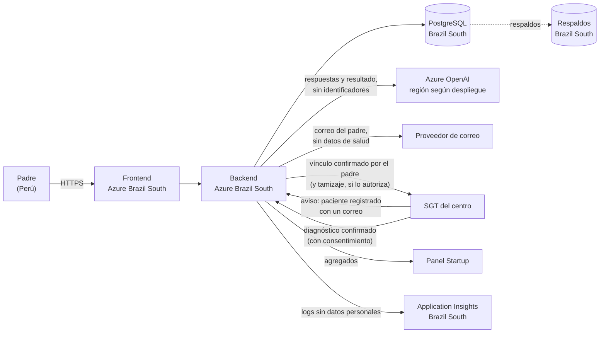

# Evaluación de datos y privacidad de Conecta

Evaluación de impacto en protección de datos de la **Solución 1: Conecta** (plataforma de tamizaje de TEA para padres), con base en la arquitectura acordada (`arquitectura_conecta.md`, v1.3) y las consideraciones de la app (`consideraciones_app_tamizaje.md`).

Versión 1.0 · 2026-10-02

> **Importante.** Este documento es una evaluación técnica y de cumplimiento preparada por el equipo. **No reemplaza la opinión de un abogado.** Los puntos marcados con **[verificar]** dependen de la lectura exacta de la norma y deben confirmarse con asesoría legal antes de lanzar. La sección 14 reúne las preguntas para el asesor.

---

## 0. Resumen ejecutivo

**Conclusión:** Conecta puede operar legalmente en el Perú, pero trata **datos de salud de menores de edad**, que son la categoría más protegida de la Ley N.º 29733. Eso exige **consentimiento expreso y por escrito** del padre o tutor, medidas de seguridad reforzadas, un **oficial de datos personales**, inscribir el banco de datos ante la ANPD, reglas claras para el envío de datos fuera del Perú (Azure en Brasil y el proveedor del LLM) y notificar incidentes en **48 horas**.

**Riesgos principales:**

| # | Riesgo | Nivel antes de controles | Control principal |
|---|---|---|---|
| 1 | Filtración de la base con datos de salud de niños | **Alto** | Cifrado, red privada, acceso mínimo con MFA, auditoría, plan de incidentes |
| 2 | Daño por un resultado equivocado (falso negativo o falso positivo) | **Alto** | Avisos "no es diagnóstico", recomendar evaluación profesional siempre, monitoreo del modelo |
| 3 | Datos enviados a países no informados (LLM "Global", respaldos geo-redundantes en EE. UU.) | **Medio** | LLM con despliegue regional, respaldos sin replicación fuera de Brasil, informarlo en el consentimiento |
| 4 | Consentimiento inválido (no lo da el tutor, casillas premarcadas, finalidades mezcladas) | **Medio** | Consentimiento por finalidad, declaración de ser padre o tutor, registro versionado |
| 5 | Vínculo padre–centro creado sin que el padre lo quiera, o que revele al centro que la familia usó Conecta | **Medio** | Respuesta idéntica al SGT exista o no la cuenta; el centro solo se entera si el padre confirma; vencimiento a 30 días; revocación |
| 6 | Reidentificación de niños en las métricas para centros | **Medio** | Solo agregados con mínimo 5 casos por celda |
| 7 | Datos de salud en correos, logs o herramientas internas (Notion, WhatsApp del equipo) | **Medio** | Correos sin datos de salud, logs con lista blanca de campos, política interna |

**Acciones obligatorias antes de lanzar** (detalle en la sección 15):

1. Consentimiento expreso por finalidad, con declaración de ser padre, madre o tutor, y texto versionado.
2. Política de privacidad publicada.
3. Inscribir el banco de datos ante la ANPD.
4. Designar un oficial de datos personales.
5. LLM en despliegue **regional** (Brazil South) y con **monitoreo de abuso modificado** (sin retención de 30 días), o informar el destino real.
6. Respaldos de PostgreSQL **sin replicación geográfica** a EE. UU.
7. Correos sin datos de salud.
8. Logs sin datos personales ni de salud.
9. Procedimiento ARCO operativo (descarga y eliminación desde la cuenta).
10. Plan de respuesta a incidentes con notificación en 48 horas.
11. Opinión legal sobre DIGEMID (dispositivo médico) y sobre la Ley de IA.

---

## 1. Alcance y método

**Alcance:** todos los datos que Conecta recoge, genera, guarda, envía o recibe: frontend (Next.js), backend (FastAPI), PostgreSQL, worker y jobs, MLflow, proveedor del LLM, correo, y los intercambios con el SGT y el Panel Startup. Los datos internos del SGT (pacientes y citas de los centros) y del Panel quedan fuera, salvo en lo que se cruza con Conecta.

**Método:**

1. Inventario de datos: qué dato, de quién, para qué, dónde vive, quién accede y por cuánto tiempo (sección 4).
2. Mapa de flujos y transferencias internacionales (sección 5).
3. Base legal y consentimiento por finalidad (sección 6).
4. Riesgos: probabilidad × impacto antes y después de los controles (sección 10).
5. Controles técnicos y organizativos (sección 11) y plan de acción (sección 15).

Este documento funciona como **evaluación de impacto** del tratamiento y se debe actualizar ante cualquier cambio de finalidad, proveedor, país de alojamiento o tipo de dato.

---

## 2. Marco normativo

| Norma | Qué exige | Cómo aplica a Conecta |
|---|---|---|
| **Ley N.º 29733**, Ley de Protección de Datos Personales | Principios (consentimiento, finalidad, proporcionalidad, calidad, seguridad), derechos ARCO, consentimiento **expreso y por escrito** para datos sensibles, reglas de flujo transfronterizo | Norma principal. Los datos de salud son **sensibles** |
| **Reglamento**: D.S. N.º 016-2024-JUS (vigente desde el 30-03-2025; reemplazó al D.S. 003-2013-JUS) | Oficial de datos personales en ciertos casos, notificación de incidentes a la ANPD en **48 horas** (y a los titulares si les afecta), consentimiento de quien ejerce la patria potestad o tutela para servicios digitales dirigidos a menores de 14 años, cláusulas contractuales para transferencias a países sin nivel adecuado, plazos ARCO | Obligaciones operativas de la sección 15 |
| **Ley N.º 26842**, Ley General de Salud | Confidencialidad de la información sobre la salud de las personas | Refuerza el deber de reserva, aunque Conecta no es un establecimiento de salud **[verificar alcance]** |
| **Ley N.º 27337**, Código de los Niños y Adolescentes | Interés superior del niño | Criterio rector: ante la duda, la opción que más proteja al niño |
| **Ley N.º 31814** y su reglamento, D.S. N.º 115-2025-PCM (vigente desde el 22-01-2026) | Clasificación de sistemas de IA por riesgo; en salud: transparencia algorítmica, supervisión humana, políticas internas y registro documentado de los sistemas de alto riesgo | El modelo de ML y el agente IA en salud infantil probablemente califican como **riesgo alto** **[verificar]** (sección 12) |
| **Ley N.º 29459** y normas de dispositivos médicos (DIGEMID) | Un software con fines médicos (incluido el diagnóstico) puede ser dispositivo médico y requerir registro sanitario | Conecta debe presentarse como **tamizaje orientativo**, no como diagnóstico. Requiere opinión regulatoria **[verificar]** |
| **Ley N.º 29571**, Código de Protección y Defensa del Consumidor | Información veraz, publicidad no engañosa | Cómo se comunica el servicio a los padres y a los centros (por ejemplo, no prometer "detectar autismo") |
| **LGPD de Brasil** (Ley 13.709/2018) | Se aplica al tratamiento realizado en territorio brasileño, con una excepción para datos que vienen de otro país y no se comparten con agentes brasileños | Al alojar en São Paulo, en principio aplica la excepción **[verificar]** |

---

## 3. Roles

| Actor | Rol según la Ley 29733 | Sobre qué datos |
|---|---|---|
| **Neuroa (la startup)** | **Titular del banco de datos / responsable del tratamiento** | Cuentas de padres, evaluaciones, resultados, consentimientos, eventos, datos para reentrenar |
| **Neuroa** | **Encargado del tratamiento** de cada centro | Datos que los centros cargan en el SGT (pacientes, citas, sedes, terapias) |
| **Centro terapéutico** | **Responsable** de sus pacientes en el SGT | Si el padre confirma el vínculo y decide compartir su tamizaje, ese dato pasa a ser también del centro |
| **Microsoft (Azure)** | **Encargado** (subencargado) | Alojamiento, base de datos, respaldos, monitoreo, LLM |
| **Proveedor de correo** | **Encargado** | Correo del padre y contenido de los correos |
| **Padre, madre o tutor** | **Titular** de sus datos y representante del niño | Ejerce los derechos ARCO por el niño |
| **Niño o niña** | **Titular** de sus datos (datos sensibles) | Edad, sexo, respuestas y resultado |

**Consecuencias prácticas:**

- Los contratos con los centros deben incluir un **acuerdo de encargo de tratamiento** (para el SGT), la **autorización para usar el correo del paciente** en el aviso de vínculo y reglas de **transferencia** (para el tamizaje que el padre decida compartir).
- Con Microsoft rige su acuerdo de protección de datos (*Data Protection Addendum*). Hay que revisarlo y archivarlo.
- Los diagnósticos confirmados que el SGT devuelve a Conecta son una **transferencia del centro a Neuroa**. Necesitan el consentimiento del padre para esa finalidad: se pide cuando confirma el vínculo con el centro (sección 6).

---

## 4. Inventario de datos

### 4.1 Datos personales

| Dato | De quién | Categoría | Finalidad | Dónde se guarda | Quién accede | Conservación | ¿Va al LLM? |
|---|---|---|---|---|---|---|---|
| Correo (usuario de la cuenta) | Padre | Identificativo | Iniciar sesión, recuperar la contraseña, avisos de la cuenta y de incidentes | `app.parents` | Backend; soporte con permiso | Mientras la cuenta esté activa | **No** |
| Distrito | Padre | Personal (ubicación aproximada) | Ordenar las sedes por cercanía | **No se guarda en la cuenta**: se elige en la pantalla de sedes y viaja en la consulta | Backend | Solo durante la consulta | Sí (para filtrar terapias) |
| Contraseña (hash argon2) | Padre | Credencial | Autenticación | `app.parents` | Nadie la ve | Mientras la cuenta esté activa | No |
| Fecha de nacimiento | Niño | Personal | Calcular `age_months` | **No se guarda** (se calcula y se descarta) | — | — | No |
| Edad en meses, sexo | Niño | Personal (de un menor) | Reglas por edad, auditoría de sesgos | `app.assessments` | Backend | Con la evaluación | Edad sí; sexo solo como contexto |
| Respuestas Q-CHAT-10 (índice 0–4) | Niño | **Sensible (salud)** | Tamizaje | `app.answers` | Backend | Con la evaluación | Sí, sin identificadores |
| Comorbilidades (habla, aprendizaje, genética, etc.) | Niño | **Sensible (salud)** | Reglas clínicas y perfiles | `app.answers` | Backend | Con la evaluación | Sí, sin identificadores |
| Antecedente familiar de autismo | Niño y **un familiar** | **Sensible (salud de un tercero)** | Regla clínica | `app.answers` | Backend | Con la evaluación | Sí, solo sí/no |
| Probabilidad, nivel, perfil, reglas activadas | Niño | **Sensible (salud inferida)** | Resultado | `app.results` | Backend; el padre | Con la evaluación | Sí |
| Explicación y terapias sugeridas | Niño | **Sensible** | Resultado | `app.explanations` | Backend; el padre | Con la evaluación | Es la salida del LLM |
| Consentimientos (versión, finalidades, fechas) | Padre | Prueba de cumplimiento | Demostrar el consentimiento | `app.consents` | Backend; oficial de datos | Plazo legal posterior a la revocación **[verificar]** | No |
| Vínculo padre–centro | Padre y niño | Personal; **sensible** si el padre comparte el tamizaje | Saber si llegó al centro por Neuroa; compartir el tamizaje y recibir el diagnóstico si lo autoriza | `app.center_links` → SGT | El centro, solo si el padre confirma | Con la evaluación; los avisos pendientes vencen a los 30 días | No |
| Aviso de paciente registrado (correo que envía el SGT) | Padre | Identificativo | Encontrar la cuenta para preguntarle al padre | **No se guarda**: si no hay cuenta, se descarta; si la hay, solo queda el vínculo pendiente | Backend | Solo durante el procesamiento | No |
| Diagnóstico confirmado | Niño | **Sensible** | Reentrenar el modelo | `ml.confirmed_diagnoses` | Equipo de ML | Ver sección 9 | No |
| IP, navegador, hora de las peticiones | Padre | Técnico (personal) | Seguridad y errores | Logs y Application Insights | Equipo técnico | 90 días | No |
| Cookie de sesión | Padre | Técnico | Mantener la sesión | Navegador | — | Hasta cerrar sesión o vencer | No |

### 4.2 Datos que no son personales (si se cumplen las condiciones)

| Dato | Condición para que no sea personal | Dónde |
|---|---|---|
| Eventos (visita, clic en WhatsApp, llamada o correo) | Solo `tenant_id`, `location_id`, tipo y fecha. **Sin** id del padre, id de sesión ni IP | `app.events` |
| Métricas para el Panel y los centros | Solo agregados, con **mínimo 5 casos** por celda (por ejemplo, por centro, mes y nivel) | Endpoints `/internal/metrics/*` |
| Dataset anonimizado para entrenar | Sin ids, sin fecha exacta, edad en bandas, sin centro ni distrito. Con diagnóstico enlazado, **no** es anónimo (sección 9) | Artefactos de MLflow |

### 4.3 Datos de los centros

- Teléfono, correo y WhatsApp de cada sede los gestiona el centro en el SGT. En centros pequeños pueden ser el **número personal de un terapeuta**: los términos del SGT deben decir que el centro está autorizado a publicarlos.
- Las descripciones de las terapias son públicas y las lee el LLM. No deben incluir datos de pacientes.

### 4.4 Lo que Conecta **no** debe recoger

- Nombre, DNI ni foto del niño.
- DNI del padre (no hace falta para el tamizaje).
- Texto libre del padre sobre el niño en esta fase: puede contener datos de salud no previstos y dificulta controlar lo que llega al LLM.
- Datos de geolocalización precisa: basta con el distrito.
- Fecha de nacimiento guardada: basta con la edad en meses.

---

## 5. Flujos de datos y transferencias internacionales

### 5.1 Mapa

### 5.2 Transferencias fuera del Perú

| Destino | Qué datos | País | Requisito |
|---|---|---|---|
| Azure (frontend, backend, PostgreSQL, Blob, Key Vault, Application Insights) | Todos | **Brasil** (Brazil South, São Paulo) | Brasil tiene ley (LGPD) y autoridad (ANPD de Brasil); confirmar si la autoridad peruana lo considera de **nivel adecuado** **[verificar]**. Si no, cláusulas contractuales (el DPA de Microsoft) e informarlo en el consentimiento |
| **Respaldos geo-redundantes** de PostgreSQL | Todos | **EE. UU.** (la región pareja de Brazil South es South Central US) | **Recomendación: no activarlos.** Usar respaldos con redundancia local o por zonas dentro de Brasil |
| **Azure OpenAI con despliegue *Global*** | Respuestas, resultado, edad, distrito | **Cualquier región de Azure** (incluido EE. UU.) | Evitarlo, o informarlo como transferencia a EE. UU. y otros países |
| **Azure OpenAI con despliegue *Standard* (regional) en Brazil South** | Igual | **Brasil** | **Recomendado.** Confirmar qué modelos hay disponibles en esa región |
| Proveedor de correo | Correo del padre | Según el proveedor | Elegir uno con DPA; preferir Azure Communication Services con datos en Brasil **[verificar disponibilidad]** |
| Soporte técnico de Microsoft | Solo si se abre un caso | Variable | No compartir datos reales en los casos de soporte |

**Sobre el LLM (Azure OpenAI):**

- Según Microsoft, los datos enviados **no se usan para entrenar** sus modelos.
- Por defecto, Azure aplica un **monitoreo de abuso** que puede guardar prompts y respuestas marcados hasta **30 días** para revisión, incluso humana. Para eliminarlo se debe **solicitar el monitoreo de abuso modificado** a Microsoft. **La arquitectura decía "sin retención (exigido en el contrato)": en realidad no basta con el contrato, hay que pedirlo y que lo aprueben.**
- El tipo de despliegue define dónde se procesa:
  - **Global:** cualquier región.
  - **Data Zone:** solo existe para EE. UU. y la UE.
  - **Standard (regional):** solo en la región elegida.
- Los modelos nuevos suelen salir primero en Global. Antes de elegir el LLM (sección 7.2 de la arquitectura) hay que confirmar cuáles candidatos existen como **Standard en Brazil South**. Si el elegido solo existe en Global, la decisión se vuelve también de privacidad: informar la transferencia o elegir otro modelo.

---

## 6. Base legal y consentimiento

### 6.1 Por qué hace falta consentimiento

Los datos de salud son **sensibles** y su tratamiento requiere consentimiento **expreso y por escrito** del titular; en medios digitales se admite la firma electrónica o un mecanismo equivalente, como casillas no premarcadas con registro. Como el titular es un niño **menor de 14 años**, consiente **quien ejerce la patria potestad o la tutela**. Para la cuenta del padre (solo correo y contraseña) la base es la **ejecución del servicio** que solicita, pero conviene cubrirlos en el mismo acto.

### 6.2 Finalidades

Cada finalidad lleva una casilla separada, ninguna premarcada. Ninguna finalidad opcional condiciona el uso del tamizaje.

| Finalidad | ¿Obligatoria para usar el servicio? | Cuándo se pide |
|---|---|---|
| **(a)** Calcular el tamizaje con las respuestas del niño, incluido el procesamiento por IA (modelo y agente con un proveedor en la nube fuera del Perú) | **Sí** (sin ella no hay servicio) | Antes de la primera pregunta |
| **(b)** Guardar el resultado en la cuenta del padre para verlo después | Sí, si el resultado se muestra después de crear la cuenta; opcional si el tamizaje es anónimo (ver 6.4) | Al crear la cuenta |
| **(c)** Confirmar el **vínculo con un centro** que lo registró como paciente y, si quiere, compartir con ese centro el tamizaje | No | Cuando le llega el aviso del centro, en `/account/centers` |
| **(d)** Autorizar que ese centro **informe el resultado de la evaluación profesional** a Neuroa para mejorar el modelo | No | Junto con (c), en casilla aparte |
| **(e)** Usar datos **anonimizados** del tamizaje para mejorar el modelo y para investigación | No (si son realmente anónimos, legalmente no requiere consentimiento, pero se pide por transparencia) | Al terminar el tamizaje |
| **(f)** Recibir novedades y comunicaciones comerciales de Neuroa | No | En la cuenta, nunca por defecto |

Antes de aceptar (a), el padre debe ver de forma clara:

- quién es el responsable (razón social, RUC y domicilio);
- qué datos se recogen y para qué;
- que se usan **sistemas de IA** y que el resultado **no es un diagnóstico**;
- que los datos se alojan en **Brasil** (y en el país del LLM, si no es regional);
- con quién se comparten (con ningún centro, salvo que el padre confirme el vínculo cuando un centro lo registre como paciente);
- por cuánto tiempo se guardan;
- cómo ejercer sus derechos y cómo revocar el consentimiento;
- el banco de datos inscrito y el contacto del oficial de datos personales.

### 6.3 Texto base del consentimiento (borrador)

Borrador en lenguaje simple, para revisión legal:

> **Antes de empezar**
>
> Para calcular el resultado necesitamos sus respuestas sobre el desarrollo de su hijo o hija. Son datos de salud y los protegemos con especial cuidado.
>
> - No le pediremos el nombre de su hijo/a.
> - Sus respuestas se procesan con inteligencia artificial en servidores de Microsoft Azure ubicados en Brasil.
> - El resultado es orientativo y **no es un diagnóstico**.
> - No compartiremos sus datos con ningún centro sin que usted lo autorice.
>
> ☐ Declaro que soy padre, madre o tutor legal del niño o niña, y autorizo el uso de sus respuestas para calcular el resultado del tamizaje. *(obligatoria)*
>
> ☐ Autorizo usar las respuestas, **sin datos que nos identifiquen**, para mejorar el modelo y para investigación. *(opcional)*
>
> [Leer la política de privacidad completa]

Cuando un centro registra al padre como paciente (en `/account/centers`):

> **[Centro]** te registró como paciente.
>
> ☐ Sí, llegué a este centro gracias a Neuroa.
>
> ☐ Quiero compartir con **[Centro]** el tamizaje de **[evaluación del (fecha)]**. *(opcional)*
>
> ☐ Autorizo que **[Centro]** informe a Neuroa el resultado de la evaluación profesional, para mejorar la precisión de la herramienta. *(opcional)*
>
> [No, no reconozco este centro / No quiero vincularlo]

### 6.4 Registro y revocación

- Cada aceptación se guarda en `app.consents`: versión del texto, finalidades, fecha y hora, y referencia a la sesión. Nunca se sobrescribe; una nueva versión del texto genera un nuevo consentimiento.
- La revocación se hace desde la cuenta con la misma facilidad que la aceptación:
  - **(c)** deshace el vínculo y detiene envíos futuros. Si ya compartió el tamizaje, ese dato queda en poder del centro, que es responsable de él; el padre debe pedirle la eliminación al centro, y Neuroa se lo informa.
  - **(d)** detiene la recepción de diagnósticos y elimina los ya recibidos que no se hayan anonimizado.
  - **(e)** excluye las evaluaciones de futuros entrenamientos.

### 6.5 Decisiones de producto con impacto en privacidad

| Tema | Hoy | Recomendación |
|---|---|---|
| **¿Cuenta antes del resultado?** | **Decidido:** la cuenta se crea antes de ver el resultado y **solo pide correo y contraseña** | Aceptable: la cuenta es mínima y sirve para guardar el resultado y ejercer los derechos ARCO. La finalidad (b) pasa a ser obligatoria y debe decirse antes de empezar. Nombre y teléfono solo se piden al compartir con un centro Integral. Usar el **correo** como usuario (no un nombre de usuario libre): sin correo no hay recuperación de contraseña ni forma de avisar al padre de un incidente |
| **Edad máxima aceptada** | 12–216 meses (hasta 18 años) | Limitar a **menores de 14 años** (< 168 meses). El Q-CHAT-10 es para niños pequeños, y entre los 14 y los 17 años las reglas de consentimiento del adolescente cambian. Con eso todo el servicio queda bajo el consentimiento de quien ejerce la patria potestad o la tutela |
| **Antecedente familiar** | Pregunta por familiares con autismo | Mantener solo sí/no y el grado (primer grado u otro), sin identificar a la persona |
| **PDF del resultado** | Se envía por correo | **No adjuntar datos de salud al correo**. El correo solo avisa que el resultado está disponible; el PDF se descarga desde la cuenta |

---

## 7. Transparencia: contenido mínimo de la política de privacidad

1. Identidad y domicilio del titular del banco de datos (Neuroa: razón social, RUC, dirección) y el contacto del **oficial de datos personales**.
2. Nombre y código de inscripción del banco de datos ante la ANPD.
3. Qué datos se recogen, separando los del padre, los del niño y los técnicos, y cuáles son sensibles.
4. Finalidades de la sección 6.2 y cuáles son opcionales.
5. Uso de inteligencia artificial: qué hace el modelo y el agente, que el resultado es orientativo y que no hay decisiones automáticas con efectos jurídicos.
6. Destinatarios: Microsoft Azure (alojamiento y LLM), el proveedor de correo y el centro que el padre elija.
7. Transferencias internacionales: Brasil (y EE. UU. u otros, si el LLM no es regional).
8. Plazos de conservación (sección 9).
9. Derechos ARCO y cómo ejercerlos (sección 8), y el derecho a reclamar ante la ANPD.
10. Consecuencias de no dar los datos: sin las respuestas no se puede calcular el tamizaje.
11. Cookies: solo la de sesión, sin publicidad ni rastreo de terceros. Si en el futuro se agrega analítica, será anónima o con consentimiento.
12. Fecha de la versión e historial de cambios.

---

## 8. Derechos ARCO

| Derecho | Cómo se ejerce en Conecta | Plazo de respuesta |
|---|---|---|
| **Acceso** | Botón "Descargar mis datos" en `/account`: JSON y PDF con la cuenta, las evaluaciones, los resultados, los consentimientos y los envíos a centros | 20 días hábiles **[verificar]**; la descarga es inmediata |
| **Rectificación** | Editar los datos de la cuenta. Las respuestas de un tamizaje no se editan: se hace uno nuevo, porque el resultado depende de ellas | 10 días hábiles **[verificar]** |
| **Cancelación (supresión)** | "Eliminar mi cuenta": borra la cuenta y sus evaluaciones (o las anonimiza si el padre aceptó la finalidad (e)), revoca los consentimientos e informa qué centros recibieron su tamizaje | 10 días hábiles **[verificar]** |
| **Oposición** | Revocar finalidades opcionales desde la cuenta | 10 días hábiles **[verificar]** |
| **Portabilidad** (si el reglamento la incluye) **[verificar]** | La misma descarga en JSON | — |

**Notas de implementación:**

- La eliminación también debe quitar los datos del padre en el proveedor de correo y excluir sus evaluaciones de los entrenamientos futuros. Los modelos ya entrenados no se pueden "desentrenar"; por eso solo se entrena con datos anonimizados o con consentimiento (d).
- Los **respaldos** conservan los datos borrados hasta que vencen (hasta 35 días en PostgreSQL Flexible). La política debe decirlo y, si se restaura un respaldo, se vuelven a aplicar las eliminaciones registradas.
- Canal alternativo: un correo de privacidad atendido por el oficial de datos, con un registro de las solicitudes y sus respuestas.
- **Decisión para el lanzamiento:** el botón **"Eliminar mi cuenta"** en `/account` y el correo de privacidad para el resto de pedidos (acceso, rectificación, oposición), atendidos a mano por el oficial de datos. La **descarga de datos** desde la cuenta se agrega en una fase posterior. La ley exige el canal y los plazos, no el botón.
- Verificar la identidad antes de responder: la sesión iniciada basta; por correo, confirmar desde la dirección registrada.

---

## 9. Conservación

Actualiza la tabla acordada en `arquitectura_conecta.md` (sección 4.4):

| Dato | Plazo | Al vencer |
|---|---|---|
| Cuenta del padre | Mientras esté activa; se elimina a pedido | Eliminación |
| Evaluaciones y resultados | Mientras la cuenta esté activa, o **2 años sin actividad** (con aviso por correo 30 días antes) | Anonimización (si aceptó (e)) o eliminación |
| Fecha de nacimiento | **No se guarda** | — |
| Consentimientos | Mientras existan los datos, más el plazo de prescripción de posibles reclamos **[verificar]** | Eliminación |
| Vínculos con centros | Igual que la evaluación; los pendientes vencen a los 30 días | Eliminación |
| Diagnósticos confirmados | Mientras el consentimiento (d) esté vigente | Se eliminan al revocar; si ya se usaron para entrenar, quedan solo en el dataset anonimizado |
| Dataset anonimizado de entrenamiento | Sin plazo, **solo si es realmente anónimo** (sin ids, edad en bandas, sin fechas exactas, sin centro ni distrito) | — |
| Eventos de clics y visitas | 24 meses | Eliminación |
| Logs técnicos (con IP) | 90 días | Eliminación automática |
| Respaldos de PostgreSQL | 7 a 35 días, según configuración | Vencimiento automático |
| Datos en Azure OpenAI | **0 días** con monitoreo de abuso modificado; si no se aprueba, hasta 30 días para contenido marcado | — |

**Atención con los diagnósticos confirmados:** un diagnóstico unido a `assessment_id` y a las respuestas es **pseudonimizado**, no anónimo, porque Neuroa puede volver a vincularlo con la cuenta. Sigue siendo dato personal sensible hasta que se rompa ese vínculo. Para entrenar, el job debe generar un **extracto anonimizado** (sin `assessment_id` ni ids) y MLflow solo debe guardar ese extracto.

---

## 10. Evaluación de riesgos

**Escala:** probabilidad e impacto de 1 (bajo) a 3 (alto). Nivel = probabilidad × impacto: 1–2 bajo, 3–4 medio, 6–9 alto.

| ID | Riesgo | P | I | Nivel | Controles | Nivel residual |
|---|---|---|---|---|---|---|
| R1 | **Filtración de la base** (ataque, credencial robada, respaldo expuesto) | 2 | 3 | **Alto** | Red privada y sin acceso público a PostgreSQL, cifrado en reposo y tránsito, Entra ID con MFA, acceso privilegiado temporal, rotación de secretos en Key Vault, auditoría, pruebas de penetración | Medio |
| R2 | **Toma de una cuenta de padre** (contraseña débil o reutilizada) y exposición del resultado del niño | 2 | 2 | Medio | Contraseña robusta, límite de intentos, verificación del correo, sesión con vencimiento, aviso por correo de inicio de sesión nuevo | Bajo |
| R3 | **Datos de salud fuera de la región informada** (LLM Global, respaldos geo-redundantes, soporte) | 2 | 2 | Medio | Despliegue regional del LLM, respaldos sin geo-redundancia, política de soporte sin datos reales, Azure Policy que bloquee despliegues Global | Bajo |
| R4 | **Retención en el proveedor del LLM** (monitoreo de abuso hasta 30 días) | 3 | 2 | **Alto** | Solicitar el monitoreo de abuso modificado (requiere contrato empresarial con Microsoft; ver 16.2); mientras tanto, informarlo en la política y enviar solo lo necesario, sin identificadores | Bajo (aprobado) / Medio |
| R5 | **Identificadores enviados al LLM** por error | 1 | 3 | Medio | El prompt se arma con una lista blanca de campos; test automático que falla si aparece correo, nombre o teléfono | Bajo |
| R6 | **Inyección de instrucciones** en las descripciones de terapias que escriben los centros | 2 | 1 | Bajo | El agente solo tiene los datos de esa evaluación; la salida se valida contra la lista devuelta; las descripciones se revisan al registrarlas | Bajo |
| R7 | **Consentimiento inválido** (no lo da el tutor, casillas premarcadas, finalidades mezcladas, texto no versionado) | 2 | 2 | Medio | Sección 6: declaración de tutor, casillas separadas, versionado, prueba de UX | Bajo |
| R8 | **Vínculo con un centro que el padre no quiere**, o el centro deduce que la familia usó Conecta | 2 | 2 | Medio | El SGT recibe siempre la misma respuesta; nada llega al centro sin confirmación del padre; opción "no reconozco este centro"; vencimiento y revocación | Bajo |
| R9 | **Reidentificación** en métricas para centros (distrito pequeño + edad + mes) | 2 | 2 | Medio | Solo agregados con mínimo 5 casos por celda; sin edad exacta ni distrito en los reportes a centros | Bajo |
| R10 | **Datos de salud en correos** (PDF adjunto reenviado o leído por terceros) | 2 | 2 | Medio | Correos sin datos de salud; PDF solo desde la cuenta | Bajo |
| R11 | **Datos personales en logs** o en Application Insights | 2 | 2 | Medio | Logs estructurados con lista blanca, sin cuerpos de petición, IP enmascarada (por defecto en Application Insights), 90 días | Bajo |
| R12 | **Acceso interno excesivo** (el equipo consulta datos reales en producción, los copia a Notion, Excel o WhatsApp) | 2 | 2 | Medio | Roles mínimos, consultas solo sobre vistas anonimizadas, auditoría, política interna y acuerdos de confidencialidad | Bajo |
| R13 | **Datos reales en desarrollo o pruebas** | 2 | 2 | Medio | Solo datos sintéticos fuera de producción; prohibido copiar la base de producción | Bajo |
| R14 | **Guardado en el dispositivo del padre** (celular compartido, `localStorage`) | 2 | 2 | Medio | Sin datos de salud en `localStorage`; avance de la prueba en memoria o `sessionStorage`; cerrar sesión borra todo | Bajo |
| R15 | **Diagnósticos devueltos sin control** (pseudonimizados guardados para siempre) | 2 | 2 | Medio | Sección 9: consentimiento (d), extracto anonimizado, eliminación al revocar | Bajo |
| R16 | **Daño por resultado equivocado**: un falso negativo retrasa la consulta, un falso positivo genera angustia | 2 | 3 | **Alto** | Avisos "no es diagnóstico", recomendar siempre vigilancia del desarrollo y consulta, nivel según sensibilidad alta, monitoreo y validación local (consideraciones 4.8) | Medio |
| R17 | **Conflicto de interés**: inflar el riesgo para derivar pacientes a centros que pagan | 1 | 3 | Medio | Capas 1 y 2 deterministas y auditables; el orden de los centros no depende del pago; métricas por nivel en el Panel | Bajo |
| R18 | **Incumplimiento regulatorio**: banco no inscrito, sin oficial de datos, incidente no notificado en 48 horas | 2 | 2 | Medio | Plan de la sección 15, con responsables y fechas | Bajo |
| R19 | **Clasificación como dispositivo médico** (DIGEMID) por cómo se comunica el producto | 1 | 3 | Medio | Posicionarlo como tamizaje orientativo en la app y en el marketing; opinión regulatoria antes del lanzamiento | Bajo |
| R20 | **Proveedores sin contrato** de encargo (correo, futuros servicios) | 2 | 2 | Medio | Registro de proveedores con su DPA antes de enviarles cualquier dato | Bajo |

---

## 11. Medidas de seguridad

### 11.1 Técnicas (sobre Azure)

| Área | Medida |
|---|---|
| Red | PostgreSQL con **acceso privado** (integración con VNet o *private endpoint*), sin IP pública. Container Apps en la misma red. Solo el frontend y la API se exponen por HTTPS |
| Cifrado | TLS 1.2 o superior en todo. Cifrado en reposo de Azure (por defecto) en PostgreSQL, Blob y respaldos. Evaluar claves propias en Key Vault más adelante |
| Identidades | Entra ID con **MFA obligatorio** para el equipo. **Identidades administradas** para que la API llegue a PostgreSQL, Blob, Key Vault y Azure OpenAI sin contraseñas en el código |
| Privilegios | Nadie con acceso permanente de administrador a producción: acceso temporal y aprobado (Privileged Identity Management o un procedimiento equivalente) |
| Base de datos | Usuarios separados: la API (lectura y escritura en `app` y `catalog`, sin permisos de estructura), migraciones (solo en el despliegue), analítica (solo vistas anonimizadas). Auditoría con `pgaudit` para accesos administrativos |
| Respaldos | Redundancia **local o por zonas en Brazil South**, sin geo-redundancia. Retención de 7 a 35 días. Prueba de restauración trimestral |
| Secretos | Todo en Key Vault; rotación de las claves entre servicios (SGT, Panel) al menos cada 90 días |
| Aplicación | Validación estricta con Pydantic, límite de peticiones (login, registro, evaluaciones), protección CSRF, cookies `httpOnly`, `Secure` y `SameSite`, cabeceras de seguridad (CSP, HSTS) |
| LLM | Despliegue regional; monitoreo de abuso modificado; prompt con lista blanca de campos; sin datos de contacto |
| Logs | Logs estructurados con lista blanca de campos; nunca respuestas, resultados ni datos de contacto; IP enmascarada; 90 días |
| Dependencias | Escaneo de vulnerabilidades en CI (dependencias e imágenes de contenedor) y actualizaciones periódicas |
| Pruebas | Prueba de penetración externa antes del lanzamiento y luego una vez al año |
| Entornos | Desarrollo y pruebas solo con datos sintéticos; producción en una suscripción o grupo de recursos separado |

### 11.2 Organizativas

- **Oficial de datos personales** designado y publicado.
- **Política interna de datos:** prohibido copiar datos de padres o niños a Notion, hojas de cálculo, WhatsApp o correo personal; los casos de soporte usan el id de la evaluación, nunca capturas con datos.
- **Acuerdos de confidencialidad** con todo el equipo y con quienes tengan acceso a producción.
- **Capacitación** inicial y anual en protección de datos.
- **Registro de proveedores** (encargados) con su contrato y país.
- **Registro de actividades de tratamiento:** este documento, actualizado.

### 11.3 Plan de respuesta a incidentes

1. **Detectar y contener** (horas 0–4): alertas de Azure Monitor y Defender; aislar el recurso afectado y rotar credenciales.
2. **Evaluar** (horas 4–24): qué datos, cuántos titulares, si hay datos de salud de niños y el riesgo para ellos.
3. **Notificar a la ANPD** dentro de **48 horas** desde que se conoce el incidente, aunque ya se haya resuelto.
4. **Notificar a los padres afectados** dentro de **48 horas** si el incidente afecta sus derechos: qué pasó, qué datos y qué hacer.
5. **Avisar a los centros** si sus datos (SGT) están involucrados, como encargado del tratamiento.
6. **Documentar** el incidente y las lecciones aprendidas, aunque no se notifique.

Responsables: oficial de datos (coordina y notifica), líder técnico (contiene y analiza), fundador(a) (comunicación).

---

## 12. Inteligencia artificial

### 12.1 Ley N.º 31814 y su reglamento

- Un sistema de IA usado en **salud** y con **menores** probablemente se clasifica como **riesgo alto** **[verificar]**. Eso implica:
  - **Transparencia algorítmica:** informar al padre que se usa IA, qué hace y sus límites.
  - **Supervisión humana:** el resultado orienta y no decide; las reglas clínicas las aprueban especialistas; la evaluación diagnóstica la hace un profesional.
  - **Registro documentado del sistema:** fuentes de datos, lógica del modelo y mecanismos de supervisión. Ya existe una base: el notebook v2, `metadata.json`, la versión de las reglas, la versión del prompt y de la base de conocimiento, y este documento.
  - **Políticas internas** de uso de IA.
- Ficha del sistema a mantener: propósito, población (18–36 meses validados), datos de entrenamiento y validación, métricas por sexo y edad, limitaciones, quién aprueba los cambios y cómo se monitorea.

### 12.2 Decisiones automatizadas

- La Ley 29733 reconoce el derecho a no ser objeto de decisiones con efectos significativos basadas **únicamente** en un tratamiento automatizado **[verificar alcance]**.
- Conecta no toma decisiones sobre el niño: entrega un resultado orientativo y siempre recomienda la evaluación profesional. Debe decirlo de forma explícita en la app y en la política.
- El orden de los centros lo decide el backend con reglas públicas (cercanía y rotación diaria).

### 12.3 Datos que llegan al LLM

| Va | No va |
|---|---|
| Edad en meses, sexo (contexto), respuestas (texto de la opción), comorbilidades, antecedente familiar (sí/no), probabilidad, nivel, perfil, reglas activadas, distrito (para filtrar terapias), terapias del catálogo | Nombre, correo, teléfono del padre, ids internos de la cuenta, IP, cualquier dato de otro niño |

---

## 13. Proveedores y contratos

| Proveedor | Servicio | Datos | Contrato a revisar | País |
|---|---|---|---|---|
| Microsoft Azure | Hosting, PostgreSQL, Blob, Key Vault, Monitor, Azure OpenAI | Todos | Microsoft Products and Services DPA; solicitud de monitoreo de abuso modificado | Brasil (y otros si se usa Global) |
| Proveedor de correo (por definir) | Correos transaccionales | Correo del padre | DPA del proveedor | Por definir |
| GitHub | Código fuente | **Ninguno** (prohibido subir datos reales) | — | EE. UU. |
| Notion | Gestión del equipo | **Ninguno** de padres o niños | — | EE. UU. |
| Centros (SGT) | Origen del aviso de paciente registrado; destino del vínculo confirmado y del tamizaje (si el padre lo comparte); origen de los diagnósticos | Correo del paciente (aviso); vínculo; tamizaje; diagnóstico | Contrato del centro con cláusulas de encargo (SGT), uso del correo para el aviso y transferencia (Conecta) | Perú |

---

## 14. Preguntas para el asesor legal

1. ¿Brasil tiene **nivel adecuado** de protección para la ANPD peruana, o hace falta firmar cláusulas contractuales o informar la transferencia de alguna forma especial?
2. ¿El D.S. 016-2024-JUS exige **comunicar a la ANPD** el flujo transfronterizo?
3. **Oficial de datos personales:** el reglamento permite que no sea exclusivo e incluso externo, y da plazos según el tamaño de la empresa (pequeña: noviembre de 2027; micro: noviembre de 2028). Confirmar qué plazo aplica a Neuroa y qué formación se considera "acreditada". Ver `guia_oficial_datos.md`.
4. ¿Las casillas digitales con registro de fecha, hora y versión cumplen el consentimiento **"por escrito"** para datos sensibles?
5. ¿Basta la **declaración** de ser padre, madre o tutor, o se requiere algún mecanismo adicional de verificación?
6. Plazos vigentes de respuesta a los derechos ARCO y si el nuevo reglamento incluye **portabilidad**.
7. Plazo recomendado para conservar los **consentimientos** después de la revocación.
8. ¿Un tamizaje orientativo con IA requiere **registro sanitario** ante DIGEMID? ¿Qué frases de la app o del marketing lo convertirían en dispositivo médico?
9. ¿Conecta califica como **sistema de IA de riesgo alto** bajo el D.S. 115-2025-PCM? ¿Qué registro o documentación concreta exige y ante quién?
10. ¿El **diagnóstico** que devuelve un centro requiere, además del consentimiento del padre en Conecta, un consentimiento recogido por el propio centro? ¿Basta una cláusula en el contrato para que Neuroa, como encargado del SGT, use el correo del paciente para el aviso de vínculo?
11. ¿El **antecedente familiar** (dato de salud de un tercero) necesita algún tratamiento especial?
12. ¿Aplica la **LGPD** de Brasil por alojar los datos en São Paulo, o rige la excepción para datos que vienen del extranjero?
13. Contenido mínimo del **contrato con los centros**: encargo del SGT, transferencia de resultados y responsabilidad por los datos de contacto que publican.

---

## 15. Plan de acción

### 15.1 Antes del lanzamiento (obligatorio)

| # | Acción | Responsable sugerido | Sección |
|---|---|---|---|
| 1 | Consentimiento por finalidad con declaración de tutor, texto versionado y registro en `app.consents` | Desarrollo + asesor legal | 6 |
| 2 | Política de privacidad publicada | Asesor legal + fundador(a) | 7 |
| 3 | Inscribir el banco de datos "Usuarios y evaluaciones de Conecta" en el SIPDP (gratuito, aprobación automática). Sin empresa, a nombre del fundador como persona natural; con empresa, con RUC y vigencia de poder (ver 16) | Oficial de datos | `inscripcion_anpd_borrador.md` |
| 4 | Designar al oficial de datos personales (puede tener otras funciones o ser externo; necesita formación acreditada) | Fundador(a) | `guia_oficial_datos.md` |
| 5 | Azure OpenAI con despliegue **Standard en Brazil South** y solicitud de **monitoreo de abuso modificado** | Desarrollo | 5.2 |
| 6 | Respaldos de PostgreSQL **sin geo-redundancia** | Desarrollo | 11.1 |
| 7 | PostgreSQL sin acceso público, identidades administradas, MFA y acceso temporal a producción | Desarrollo | 11.1 |
| 8 | Correos sin datos de salud; PDF solo desde la cuenta | Desarrollo | 6.5 |
| 9 | Logs con lista blanca de campos y test que impida enviar identificadores al LLM | Desarrollo | 11.1, 12.3 |
| 10 | Botón "Eliminar mi cuenta" en `/account` y correo de privacidad (la descarga de datos, en una fase posterior) | Desarrollo + oficial de datos | 8 |
| 11 | Plan de incidentes con notificación en 48 horas y responsables asignados | Oficial de datos | 11.3 |
| 12 | Métricas para centros con mínimo 5 casos por celda | Desarrollo | 4.2 |
| 13 | Limitar la edad a menores de 14 años | Producto | 6.5 |
| 14 | Opinión legal sobre DIGEMID y la Ley de IA | Asesor legal | 14 |
| 15 | Prueba de penetración externa | Proveedor externo | 11.1 |
| 16 | DPA de Microsoft y del proveedor de correo archivados | Oficial de datos | 13 |
| 17 | Contrato modelo con los centros (encargo del SGT, uso del correo del paciente para el aviso de vínculo y transferencia del tamizaje) | Asesor legal | 3 |

### 15.2 Después del lanzamiento

- Revisar este documento cada 6 meses o ante cualquier cambio de proveedor, país, finalidad o tipo de dato.
- Auditoría anual de accesos y de proveedores.
- Ejercicio anual de respuesta a incidentes.
- Reporte semestral de métricas por sexo y edad (sesgos) y del uso de las reglas clínicas.

### 15.3 Decisiones pendientes del equipo

| Decisión | Recomendación |
|---|---|
| ¿Edad máxima? | Menores de 14 años |
| ¿Modelo LLM? | Elegir solo entre los disponibles como **Standard en Brazil South**; si el mejor solo existe en Global, decidir si se informa la transferencia o se elige otro |
| ¿Proveedor de correo? | Uno con DPA y datos en Brasil, de preferencia dentro de Azure |

---

## 16. Plan por etapas (RUC 10 hoy, empresa más adelante)

**Situación actual:** el fundador o fundadora tiene **RUC 10** (persona natural con negocio). Eso permite facturar a los centros y ser el titular del banco de datos. La empresa (persona jurídica, RUC 20) se constituye más adelante.

La ley **no exige tener empresa** para cumplirse: se aplica a **quien trata datos personales**, sea una empresa o una persona natural. Lo que activa las obligaciones no es el RUC sino **recoger datos reales** de padres y niños. Mientras solo haya datos de prueba, ninguna obligación está vigente todavía, pero conviene construir todo desde ya.

### 16.1 Etapas

| Etapa | Qué pasa | Quién responde legalmente | Obligaciones vigentes |
|---|---|---|---|
| **0. Desarrollo** (ahora) | Se construye la plataforma con **datos sintéticos**; no hay padres reales | Nadie: todavía no hay datos personales | Ninguna. Se deja todo implementado |
| **1. Piloto cerrado** | Pocas familias reales y pocos centros aliados, **sin cobrar** | El fundador o fundadora como **persona natural con RUC 10** | Todas las de la ley, porque ya hay datos de salud de niños. El mínimo legal de 16.3 |
| **2. Lanzamiento público y cobro a centros** | Abierto a cualquier padre; se factura a los centros | Se puede iniciar con el **RUC 10**; se recomienda pasar a una **empresa (RUC 20)** al crecer | Todas, más contratos formales, opinión legal y prueba de penetración |

**Por qué conviene pasar a una empresa (RUC 20) al crecer:**

- Con el **RUC 10 ya se puede facturar** a los centros, firmar convenios e inscribir el banco de datos. Una empresa (por ejemplo, una S.A.C.) cuesta algo más y toma más tiempo **[verificar costos actuales]**.
- Como persona natural, **las multas y reclamos recaen sobre el patrimonio personal** del fundador. Con una empresa de responsabilidad limitada, el riesgo queda en la empresa.
- Los centros, los inversionistas y Microsoft (para algunos beneficios) piden una empresa.

### 16.2 Los 15 puntos del checklist, uno por uno

| # | Punto | ¿Obligatorio por ley? | ¿Necesita RUC? | ¿Cuándo? |
|---|---|---|---|---|
| 1 | Consentimiento por finalidad, versionado y registrado | **Sí** | No (es código) | Programarlo **ahora**; vigente desde la etapa 1 |
| 2 | Política de privacidad publicada | **Sí** (deber de informar) | No. Sin empresa, el responsable es el fundador como persona natural (nombre, DNI, domicilio y correo) | Redactarla **ahora**; publicarla en la etapa 1; actualizarla al constituir la empresa |
| 3 | Banco de datos inscrito ante la ANPD | **Sí** | No necesariamente: la inscripción también aplica a personas naturales titulares de un banco de datos **[verificar en el SIPDP]** | Antes de la etapa 1. Al constituir la empresa, inscribirlo a su nombre (o transferirlo) |
| 4 | Oficial de datos personales designado | **Sí, con plazo**: una startup sin ventas es microempresa, con plazo hasta **noviembre de 2028** **[verificar]** | No | **Ahora**, de forma interna: elegir quién cumple el rol y que tome un curso corto. La designación formal, con la empresa |
| 5 | Azure OpenAI regional y monitoreo de abuso modificado | El despliegue regional no es obligatorio, pero evita declarar envíos a otros países. El monitoreo modificado **no** es obligatorio | El despliegue regional, no. El **monitoreo modificado sí lo exige en la práctica**: Microsoft solo lo da a clientes con contrato empresarial (*Enterprise Agreement*) o gestionados por su equipo; las cuentas de pago por uso no califican | Despliegue regional: **ahora**. Monitoreo modificado: en la etapa 2, con empresa (o pedirlo vía un programa como Microsoft for Startups **[verificar]**). Mientras tanto, **informar en la política** que Microsoft puede guardar hasta 30 días el contenido marcado como abuso, sin datos de identidad |
| 6 | Respaldos sin geo-redundancia; PostgreSQL sin acceso público | **Sí** (deber de seguridad) | No (es configuración) | **Ahora** |
| 7 | Correos sin datos de salud; PDF solo desde la cuenta | Deriva del deber de seguridad | No | **Ahora** (diseño) |
| 8 | Logs sin datos personales; test que impida enviar identificadores al LLM | Deriva del deber de seguridad | No | **Ahora** (código) |
| 9 | Botón "Eliminar mi cuenta" y correo de privacidad | **Sí** (derechos ARCO) | No | **Ahora** (código y un correo) |
| 10 | Plan de incidentes con notificación en 48 horas | **Sí** | No | **Ahora** (ya está en la guía del oficial; asignar responsables) |
| 11 | Métricas para centros con mínimo 5 casos por celda | Buena práctica (evita que los agregados identifiquen a alguien) | No | **Ahora** (código) |
| 12 | Edad limitada a menores de 14 años | Decisión de producto con efecto legal | No | **Ahora** |
| 13 | Opinión legal (DIGEMID y Ley de IA) | No, pero reduce mucho el riesgo | No (sí presupuesto) | Antes de la etapa 2. Opciones sin costo o de bajo costo: consultorios jurídicos de universidades, mentores de incubadoras y programas de apoyo a startups |
| 14 | Prueba de penetración externa | No | No (sí presupuesto) | Etapa 2. **Ahora**, un escaneo automático gratuito (por ejemplo, OWASP ZAP) como primer filtro |
| 15 | DPA de Microsoft y del proveedor de correo; contrato con los centros | El DPA de Microsoft se acepta **automáticamente** con los términos de Azure: solo hay que descargarlo y archivarlo. El contrato con los centros **sí** es necesario | DPA: no. Contrato con los centros: en el piloto basta un **convenio simple** firmado por el fundador; para cobrar, el contrato debe ser con la empresa | DPA: **ahora**. Convenio de piloto: etapa 1. Contrato formal: etapa 2 |

### 16.3 Mínimo legal para el piloto (etapa 1, con RUC 10)

Lo que la ley exige antes de recibir datos de familias reales. En Notion es la tarea "Cumplir el mínimo legal de privacidad para el piloto".

1. Política de privacidad publicada, con el fundador (RUC 10) como responsable y diciendo que los datos se alojan en Brasil.
2. Texto del consentimiento revisado y aprobado (sección 6.3).
3. Casillas de consentimiento por finalidad en la app, guardadas con versión y fecha.
4. Base de datos inscrita ante la ANPD en el SIPDP (`inscripcion_anpd_borrador.md`).
5. Correo de privacidad creado y con alguien que lo atienda.
6. Plan de incidentes de una página: quién contiene, quién avisa en 48 horas y quién comunica.
7. Base de datos sin acceso público, MFA y permisos mínimos para el equipo, claves en Key Vault.
8. Convenio firmado con cada centro del piloto (con la cláusula del correo del paciente si usa el SGT o el vínculo padre–centro).

Recomendación adicional: limitar el piloto a pocas familias invitadas por los centros aliados mientras no haya empresa.

### 16.4 Clasificación de todas las tareas

- **A · Obligatoria:** la ley la exige; si falta, puede haber multa de la ANPD.
- **B · Recomendada:** no es obligatoria, pero es barata y reduce mucho el riesgo de una filtración o de un reclamo.
- **C · Opcional / puede esperar:** no es obligatoria; se puede postergar o eliminar sin riesgo legal.

| Tarea | Tipo | Nota |
|---|---|---|
| Política de privacidad publicada | A | Deber de informar; debe decir que los datos se alojan en Brasil |
| Texto del consentimiento aprobado | A | Borrador en la sección 6.3 |
| Casillas de consentimiento con versión y fecha | A | Datos de salud de menores: consentimiento expreso y por escrito, que hay que poder probar |
| Inscripción ante la ANPD | A | En línea y gratis |
| Correo de privacidad | A | Canal para los pedidos de los padres (ARCO) |
| Plan de incidentes de una página | A | Notificación en 48 horas |
| Base de datos sin acceso público; MFA y permisos mínimos; claves en Key Vault | A | Parte de las medidas de seguridad que exige la ley |
| Convenio con cada centro del piloto | A | Si el centro usa el SGT o el vínculo; si solo aparece en el directorio, basta su autorización para publicar sus datos de contacto |
| Correos sin datos de salud; PDF solo desde la cuenta | B | Un correo reenviado es una filtración |
| Logs sin datos personales ni de salud | B | La filtración más común en startups |
| No guardar el avance en `localStorage` | B | Celulares compartidos |
| Edad máxima (menores de 14 años; tope clínico con especialistas) | B | Con el tope, el consentimiento del padre basta |
| Cuenta con solo correo y contraseña, con verificación del correo | B | Confirma que el correo es del padre |
| Todo en Brazil South: modelo de IA regional, respaldos sin copia en EE. UU. | B | No es obligatorio si se informa el país real; solo es configuración |
| Decidir quién tendrá el rol de oficial de datos | B | Plazo legal hasta 2028, pero alguien debe atender el correo y los incidentes |
| Descargar y guardar el DPA de Microsoft | B | Ya existe; es tenerlo como prueba |
| Acuerdos de confidencialidad | B | Deja por escrito el deber de confidencialidad |
| Botón "Eliminar mi cuenta" | C | El correo de privacidad basta mientras haya pocos pedidos |
| Botón de descarga de datos | C | Se atiende por correo |
| Test que impida enviar identificadores al modelo de IA | C | Buena práctica técnica |
| Vínculo padre–centro (aviso del SGT, `/account/centers`, vencimiento a 30 días) | C | Función del producto, no obligación legal; puede ir en fase 2 siguiendo la sección 3.8 de la arquitectura |
| Escaneo con OWASP ZAP | C | Cuando haya tiempo |
| Asesoría legal gratuita o barata (13 preguntas) | C | Muy recomendable antes del lanzamiento público |
| Opinión legal formal sobre DIGEMID y la ley de IA | C | Antes del lanzamiento público |
| Prueba de penetración externa | C | Necesita presupuesto |
| Monitoreo de abuso modificado de Microsoft | C | Requiere contrato empresarial; mientras, se informa en la política |
| Constituir la empresa (RUC 20) y pasarle inscripción, política y contratos | C | Protege el patrimonio personal al crecer |
| Designación formal del oficial de datos | C | Plazo legal para microempresa: noviembre de 2028 |

## 17. Cambios que este documento pide en otros documentos

- `arquitectura_conecta.md`:
  - En la retención, "Datos enviados al LLM: sin retención del proveedor (exigido en el contrato)" pasa a "requiere aprobar el monitoreo de abuso modificado".
  - La integración de correo pasa a "sin datos de salud".
  - Se agregan los respaldos sin geo-redundancia y el despliegue regional del LLM.
- `consideraciones_app_tamizaje.md`: la sección 9 remite a este documento.

## 18. Fuentes

- Ley N.º 29733, Ley de Protección de Datos Personales.
- Decreto Supremo N.º 016-2024-JUS, Reglamento de la Ley N.º 29733 (publicado el 30-11-2024, vigente desde el 30-03-2025). Resúmenes: [IAPP](https://iapp.org/news/a/se-publica-el-nuevo-reglamento-de-protecci-n-de-datos-personales-en-per-), [PPU](https://ppulegal.com/ppu-legal/alerta-de-nuevo-reglamento-de-la-ley-n-29733-ley-de-proteccion-de-datos-personales/), [Garrigues](https://www.garrigues.com/es_ES/noticia/peru-publica-nuevo-reglamento-ley-proteccion-datos-personales), [LP Derecho (texto)](https://lpderecho.pe/reglamento-ley-proteccion-datos-personales-decreto-supremo-016-2024-jus/), [El Peruano: oficial de datos personales](https://elperuano.pe/noticia/288028-suplemento-legal-juridica-tratas-datos-sensibles-o-grandes-volumenes-evalua-si-debes-nombrar-un-odp).
- Ley N.º 31814 y D.S. N.º 115-2025-PCM (reglamento de IA, vigente desde el 22-01-2026): [Cuatrecasas](https://www.cuatrecasas.com/es/latam/tecnologia-medios-digitales/art/que-establece-el-reglamento-de-la-ley-de-inteligencia-artificial), [EY](https://www.ey.com/es_pe/technical/tax-alert/reglamento-ley-promueve-uso-inteligencia-artificial), [El Peruano: IA con datos sensibles](https://elperuano.pe/noticia/305420-usas-ia-con-datos-sensibles-conoce-las-obligaciones-y-medidas-de-proteccion-que-debes-implementar).
- Dispositivos médicos y software: [PRCP, ABC de la regulación de dispositivos médicos en el Perú](https://blog.prcp.com.pe/wp-content/uploads/2024/04/Sobre-el-ABC-de-la-regulacio%CC%81n-de-Dispositivos-Me%CC%81dicos-en-Peru%CC%81-.pdf).
- Azure OpenAI, residencia de datos y monitoreo de abuso: [Data Zones (Microsoft)](https://azure.microsoft.com/en-us/blog/enterprise-trust-in-azure-openai-service-strengthened-with-data-zones/), [Microsoft Q&A: residencia de datos](https://learn.microsoft.com/en-us/answers/questions/5550872/inquiry-on-data-residency-compliance-and-security), [Microsoft Q&A: monitoreo de abuso](https://learn.microsoft.com/en-us/answers/questions/2286499/azure-openai-abuse-monitoring), [disponibilidad de modelos por región](https://learn.microsoft.com/en-us/azure/foundry/foundry-models/concepts/models-sold-directly-by-azure-region-availability).
